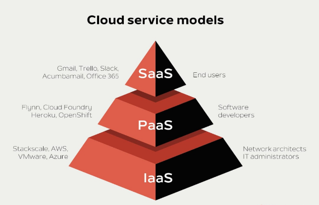

# Introduction to Cloud Computing

## Objective
This project is created to understand the basic concepts of cloud computing before starting hands-on cloud technologies in upcoming semesters.

## What is Cloud Computing?

Cloud computing is the delivery of computing services such as servers, storage, databases, networking, and software over the internet. It allows users to access resources on demand without owning physical infrastructure.

## Cloud Service Models

### IaaS (Infrastructure as a Service)
Provides virtualized computing resources such as virtual machines, storage, and networking.

### PaaS (Platform as a Service)
Provides a platform that allows developers to build, test, and deploy applications without managing infrastructure.

### SaaS (Software as a Service)
Provides software applications over the internet on a subscription basis.

## Cloud Deployment Models
- Public Cloud
- Private Cloud
- Hybrid Cloud

## Advantages of Cloud Computing
- Cost efficiency
- Scalability
- High availability
- Flexibility

## Future Scope
In my upcoming semester, I plan to work on hands-on cloud labs and extend this project with real-time cloud services.
